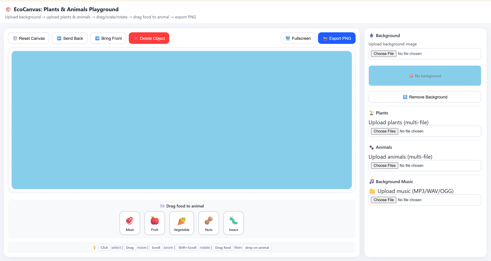
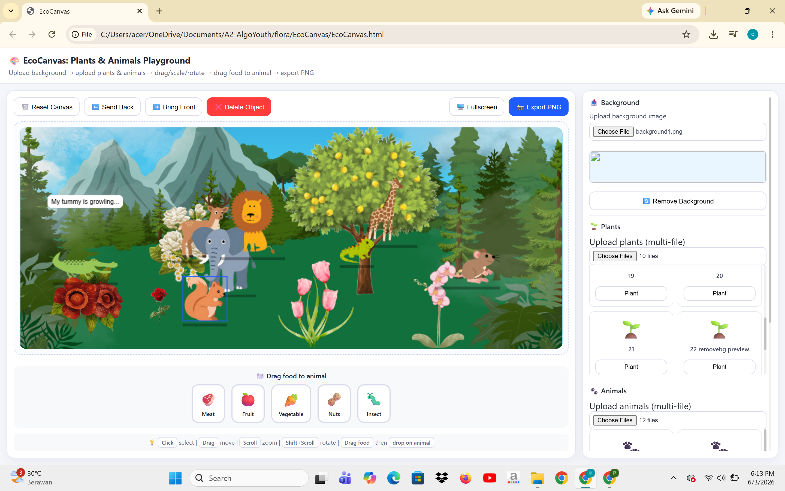
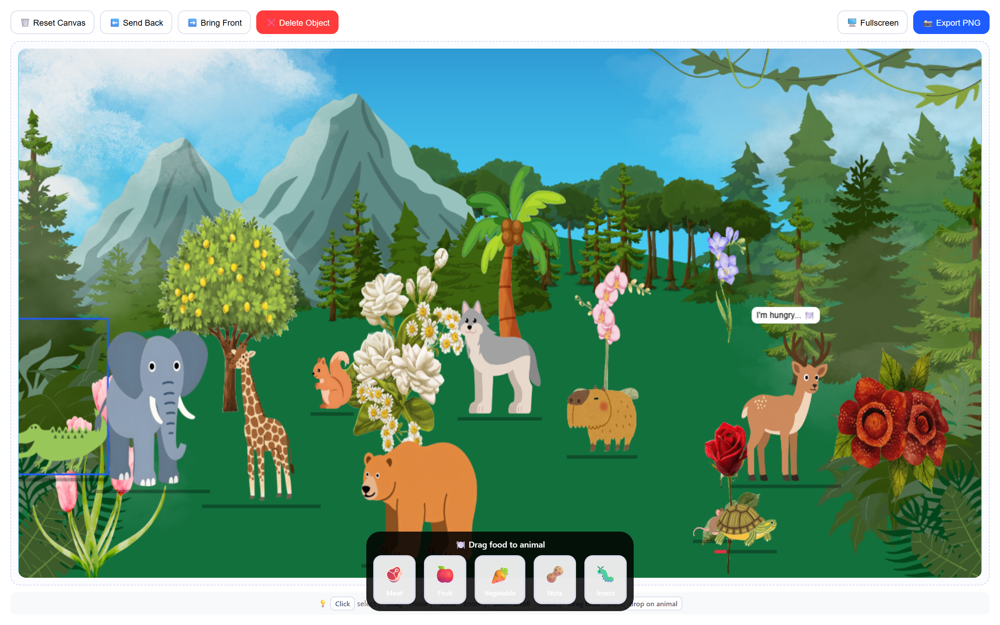

# 🌿 EcoCanvas: Plants & Animals Playground

> An interactive playground where you can create your own ecosystem: upload plant and animal images, arrange them on a canvas, and feed your favorite animals!

---

## 🌐 Quick Access

| | |
|---|---|
| **🎮 Play Now** | [EcoCanvas: Plants & Animals Playground](https://putrilia12.github.io/EcoCanvas-Interactive-Flora-Fauna-Simulator/) |
| **📺 Video Tutorial** | [How to Use Tutorial](https://youtu.be/abFlvIl0AyU) |
| **👩‍💻 Author LinkedIn** | [Putri Aurelia](https://www.linkedin.com/in/putri-aurelia-728abb342/) |

---

## 📺 Video Tutorial

**Click the thumbnail above to watch the complete tutorial on how to use EcoCanvas!**

### What's Covered in the Video:

- ✅ How to upload background images
- ✅ Adding plants and animals to the canvas
- ✅ Dragging, scaling, and rotating objects
- ✅ Feeding animals with drag & drop
- ✅ Using the music player
- ✅ Exporting your creation as PNG
- ✅ Fullscreen mode tips

---

## 📸 Screenshots

  
  
    
  

---

## 🎯 Key Features

### 🖼️ Background Management
- Upload custom background images
- Remove background to revert to default blue sky
- Real-time background preview

### 🌱 Plant & Animal Upload
- Upload multiple plant/animal images at once
- Clean thumbnail display with file names only
- One-click add to canvas

### 🎮 Interactive Canvas
- **Click** to select objects
- **Drag** to move objects anywhere
- **Scroll** to zoom in/out
- **Shift + Scroll** to rotate objects
- **Send Back / Bring Front** to layer objects

### 🍽️ Animal Feeding System

**5 food types available:**
- 🥩 Meat
- 🍎 Fruit
- 🥕 Vegetable
- 🥜 Nuts
- 🐛 Insects

**Feeding features:**
- Drag & drop food onto animals
- Animals react with speech bubbles
- Hunger bar shows satiety status
- Animals move faster after eating

### 🐾 Animal Behavior
- Animals walk left and right automatically
- Mirror effect when reaching canvas edges
- Natural up-and-down movement
- Hunger decreases over time
- Hungry animals ask for food
- Animals occasionally chat friendly

### 🎵 Background Music
- Upload MP3/WAV/OGG files
- Play/Pause/Stop controls
- Longer volume slider for easy control
- Loop option available

### 🖥️ Fullscreen Mode
- One-click fullscreen toggle
- Food bar remains visible
- Press ESC to exit

### 📸 Export
- Export canvas as PNG image
- Save your creation easily

---

## 🚀 How to Use

### Quick Start

1. **Open the application** in a modern web browser
2. **Upload a background** (optional - default blue sky works too)
3. **Upload plant images**, click the thumbnail to add to canvas
4. **Upload animal images**, click the thumbnail to add to canvas
5. **Arrange the layout** using drag, zoom, and rotate
6. **Feed animals** by dragging a food icon and dropping it onto an animal
7. **Export as PNG**

> 📺 **Interactive video tutorial:** [https://youtu.be/abFlvIl0AyU](https://youtu.be/abFlvIl0AyU)

### Step-by-Step Guide

#### 1. Setting Up Background

- Click **"Upload background image"**
- Select an image file from your computer
- The background changes immediately
- Click **"Remove Background"** to go back to blue sky

#### 2. Adding Plants

- Click **"Upload plants"** and select one or more images
- Thumbnails will appear with plant names
- Click the **"Plant"** button on any thumbnail
- The plant appears on the canvas
- **Drag** to position, **Scroll** to resize, **Shift+Scroll** to rotate

#### 3. Adding Animals

- Click **"Upload animals"** and select one or more images
- Thumbnails will appear with animal names
- Click the **"Add"** button on any thumbnail
- The animal appears and starts walking automatically!

#### 4. Feeding Animals

- Select a food type: **Meat, Fruit, Vegetable, Nuts, or Insect**
- **Drag** the food icon from the bottom bar
- **Drop** it exactly on top of the target animal
- Watch the animal's happy reaction and the hunger bar fill up!

#### 5. Managing Objects

- Use **"Send Back"** to move the selected object backward
- Use **"Bring Front"** to bring the selected object forward
- Use **"Delete Object"** to remove the selected object
- Use **"Reset Canvas"** to clear all objects

---

## 🛠️ Technologies Used

| Technology | Purpose |
|------------|---------|
| HTML5 | Structure & Canvas API |
| CSS3 | Styling & Responsive Design |
| JavaScript | Interactivity & Logic |
| Canvas API | Graphics rendering |
| Drag & Drop API | Feeding mechanic |

---

## 👩‍💻 Author

**Putri Aurelia**

- **Project Link:** [https://putrilia12.github.io/EcoCanvas-Interactive-Flora-Fauna-Simulator/](https://putrilia12.github.io/EcoCanvas-Interactive-Flora-Fauna-Simulator/)
